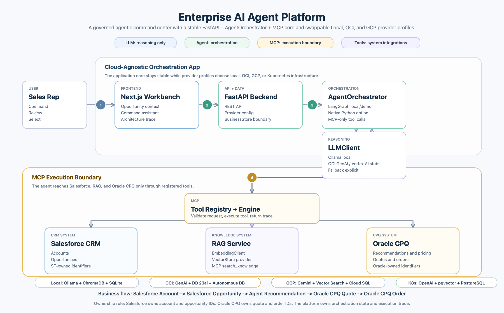

# Enterprise AI Agent Platform

**Author:** Sarala Biswal

## About

Enterprise AI Agent Platform is a demo opportunity-to-quote command center that connects Salesforce CRM, RAG-backed knowledge retrieval, LangGraph agent orchestration, MCP-style tool execution, and Oracle CPQ quote/order lifecycle automation.

The current demo showcases a Telecom / Network Infrastructure use case with NetApp-aligned product recommendations.

---

### **Business Problem**

Enterprise sales workflows are often fragmented across multiple systems:

* Salesforce CRM holds account and opportunity data.
* Oracle CPQ manages product configuration, pricing, quotes, and orders.
* Product recommendations rely on a mix of catalog data, pricing rules, sales playbooks, and deal-specific requirements.

These disconnected steps create challenges:

* Manual handoffs slow down the process.
* Limited visibility into why certain products are recommended.
* Lack of traceability across tool usage and transitions from quote to order.

There is a clear need for a governed orchestration layer that can interpret sales intent, retrieve relevant knowledge, execute enterprise tools appropriately, and maintain a transparent audit trail—without bypassing system boundaries.

---

### **Proposed Solution**

The platform introduces a streamlined, agent-powered workflow:

1. Select a Salesforce account.
2. Choose a related opportunity.
3. Request product recommendations or use a guided “next best action.”
4. Let the agent retrieve knowledge, invoke CPQ tools for recommendations and pricing, and explain the results.
5. Select desired products.
6. Generate a quote in Oracle CPQ.
7. Convert the finalized quote into an order.

Beyond automation, the platform emphasizes visibility and control. It clearly surfaces:

* Agent decisions and reasoning
* MCP-style tool executions
* Retrieved context via RAG
* Ownership of each business object across systems

The result is a transparent, governed middle layer that connects systems while keeping humans informed and in control.


## Architecture



Architecture rules enforced by the implementation:

- LLM is used for reasoning through `LLMClient`.
- Agent orchestration is implemented with LangGraph.
- MCP is the execution boundary for tools and integrations.
- Tools integrate with Salesforce, Oracle CPQ, and RAG.
- RAG is implemented as a service behind MCP and exposed only through the `search_knowledge` tool.
- The agent does not call ChromaDB, embeddings, Salesforce, or CPQ directly.

Primary flow:

```text
Sales Rep
  -> Next.js Workbench
  -> FastAPI Backend
  -> LangGraph Agent
  -> MCP Tool Boundary
  -> Salesforce CRM, RAG Service, Oracle CPQ
  -> LLMClient response with context and execution trace
```

Business object ownership:

- Salesforce owns `SF-ACC-*` Account IDs and `SF-OPP-*` Opportunity IDs.
- Oracle CPQ owns `ORA-Q-*` Quote IDs and `ORA-O-*` Order IDs.
- The agent platform owns orchestration state, agent run history, activity timeline, and explainability.

## Tech Stack

- Frontend: Next.js, React, TypeScript
- Backend: FastAPI, Python 3.11
- Agent orchestration: LangGraph
- LLM abstraction: `LLMClient` with Ollama or fallback mode
- MCP layer: local MCP execution engine and tool registry
- RAG: Ollama embeddings with `nomic-embed-text`, ChromaDB persistent store
- Business data: SQLite seeded with Telecom / Network Infrastructure accounts, opportunities, products, quotes, orders, activity, and agent runs
- Container runtime: Docker Compose with backend, frontend, and Ollama services

## Repository Layout

```text
apps/backend/            FastAPI app and API endpoints
apps/frontend/           Next.js command center UI
services/agent/          LangGraph agent flows
services/mcp/            MCP execution engine, registry, and tools
services/rag/            Embeddings, Chroma vector store, retriever, ingestion
services/data/           SQLite schema, seed data, repositories
integrations/salesforce/ Salesforce CRM mock integration
integrations/cpq/        Oracle CPQ catalog, pricing, quote, order logic
tests/                   Backend, agent, MCP, RAG, and integration tests
docs/assets/             README architecture diagram
docs/planning/           Planning, PRD, task, and design documents
```

## Prerequisites

Install these before running the full app locally:

- Python 3.11 or newer
- `uv`
- Node.js 24 or newer with npm
- Ollama, for RAG embeddings and optional local LLM reasoning
- Docker Desktop or Docker plus Compose plugin, if using the container path

Recommended Ollama models:

```bash
ollama pull nomic-embed-text
ollama pull llama3.1
```

`nomic-embed-text` is required for local RAG ingestion and retrieval. `llama3.1` is optional unless you want live Ollama reasoning instead of fallback responses.

## Local Setup

From the repository root:

```bash
uv sync --extra dev
```

Start Ollama if it is not already running:

```bash
ollama serve
```

If `ollama serve` says port `11434` is already in use, Ollama is already running.

Ingest the sample product catalog, pricing rules, and sales playbook documents into Chroma:

```bash
uv run python -m services.rag.ingest
```

Start the backend:

```bash
LLM_PROVIDER=fallback uv run uvicorn apps.backend.main:app --host 127.0.0.1 --port 8000
```

Use live Ollama reasoning instead of fallback responses:

```bash
LLM_PROVIDER=ollama uv run uvicorn apps.backend.main:app --host 127.0.0.1 --port 8000
```

Start the frontend in a second terminal:

```bash
cd apps/frontend
npm ci
NEXT_PUBLIC_API_BASE_URL=http://127.0.0.1:8000 npm run dev
```

Open the app:

```text
http://localhost:3000
```

Backend health check:

```bash
curl -s http://127.0.0.1:8000/health
```

Expected response:

```json
{"status":"ok"}
```

## Docker Setup

Build and start the full stack:

```bash
docker compose up --build
```

In another terminal, pull the Ollama models into the Compose Ollama service:

```bash
docker compose exec ollama ollama pull nomic-embed-text
docker compose exec ollama ollama pull llama3.1
```

Ingest RAG knowledge into the backend Chroma volume:

```bash
docker compose exec backend python -m services.rag.ingest
```

Then use:

```text
Frontend: http://localhost:3000
Backend:  http://localhost:8000/health
Ollama:   http://localhost:11434
```

Stop the stack:

```bash
docker compose down
```

## Validation

Run backend and architecture tests:

```bash
uv run pytest -q
```

Run a production frontend build:

```bash
cd apps/frontend
npm run build
```

Regenerate the README architecture diagram on macOS:

```bash
swift scripts/generate_architecture_diagram.swift
```

The generated file is:

```text
docs/assets/architecture.png
```

## Runtime Data

The app creates local runtime data on demand:

- SQLite business database: `app_data/business.sqlite3`
- Chroma vector database: `chroma_db/`

Both folders are ignored by git. Delete them only when you intentionally want to reset local runtime state, then restart the backend and rerun RAG ingestion.

## Corporate Network Notes

If npm or curl fails because your office network intercepts SSL, the preferred fix is to configure your company root CA certificate. For npm:

```bash
npm config set cafile /path/to/company-root-ca.pem
```

As a temporary local workaround only, you can disable npm strict SSL and then turn it back on after installation:

```bash
npm config set strict-ssl false
npm ci
npm config set strict-ssl true
```
