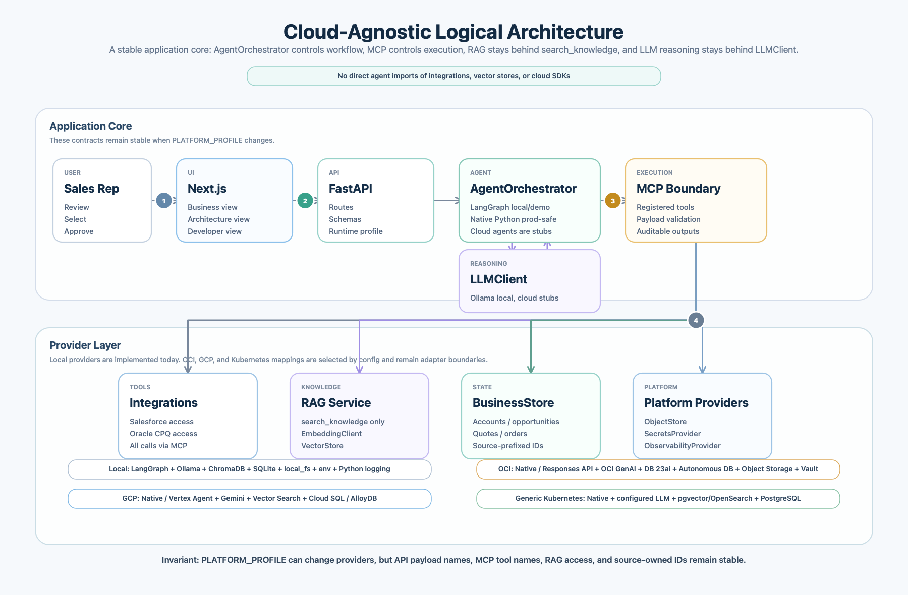

# Cloud-Agnostic Provider Architecture

Author: Sarala Biswal

## Logical Architecture



For deployable runtime components, see the [physical architecture diagram](physical-architecture-diagram.md).

The platform keeps one core business workflow and swaps infrastructure through provider interfaces:

```text
User -> Frontend -> FastAPI -> AgentOrchestrator -> MCP -> Tools/RAG -> LLMClient -> Response
```

Layer ownership is fixed:

- Agent orchestration runs through `AgentOrchestrator`.
- LangGraph is the local/demo implementation of `AgentOrchestrator`.
- Native Python orchestration is the production-safe implementation of `AgentOrchestrator`.
- MCP is the execution layer for all tools.
- Tools own integration and knowledge-access calls.
- RAG is reachable only through the MCP tool `search_knowledge`.
- LLM reasoning runs only through `LLMClient`.

The current local profile remains the default and does not require OCI or GCP credentials.

## Provider Profiles

| Capability | Local Default | OCI Target | GCP Target | Generic Kubernetes |
|---|---|---|---|---|
| Runtime | Docker Compose | OKE / OCI Compute | Cloud Run / GKE | Kubernetes |
| Agent orchestration | LangGraph / native | native / OCI Responses API | native / Vertex Agent | native Python |
| LLM | Ollama | OCI Generative AI | Vertex AI Gemini | OpenAI-compatible endpoint or fallback |
| Embeddings | Ollama | OCI Generative AI embeddings | Vertex AI Embeddings | hosted embedding endpoint |
| Vector store | ChromaDB | Oracle DB 23ai / OCI OpenSearch | Vertex Vector Search / AlloyDB vector / pgvector | pgvector / OpenSearch |
| Business store | SQLite | Autonomous Database / Oracle DB | Cloud SQL / AlloyDB / Spanner | PostgreSQL |
| Object store | local filesystem | OCI Object Storage | Cloud Storage | S3-compatible object storage |
| Secrets | environment variables | OCI Vault | Secret Manager | Kubernetes Secrets / External Secrets |
| Observability | Python logging | OCI Logging / Monitoring / APM | Cloud Logging / Monitoring / Trace | OpenTelemetry |

## Local Defaults

```env
PLATFORM_PROFILE=local
AGENT_ORCHESTRATOR=langgraph
LLM_PROVIDER=ollama
EMBEDDING_PROVIDER=ollama
VECTOR_STORE_PROVIDER=chroma
BUSINESS_STORE_PROVIDER=sqlite
OBJECT_STORE_PROVIDER=local_fs
SECRETS_PROVIDER=env
OBSERVABILITY_PROVIDER=python_logging
```

## Contract Stability

Changing `PLATFORM_PROFILE` must not change:

- FastAPI route names or response schemas.
- MCP tool names or payload contracts.
- Frontend payload field names.
- Source-owned business identifiers:
  - `sf_account_id`
  - `sf_opportunity_id`
  - `oracle_quote_id`
  - `oracle_order_id`

OCI and GCP implementations must remain behind provider adapters and must not become required dependencies for the local profile.
