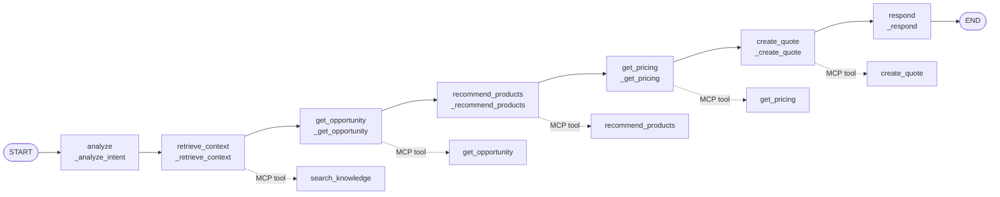
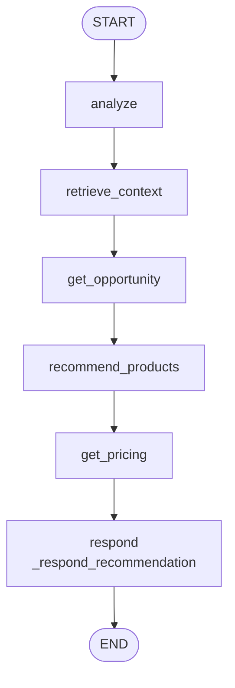
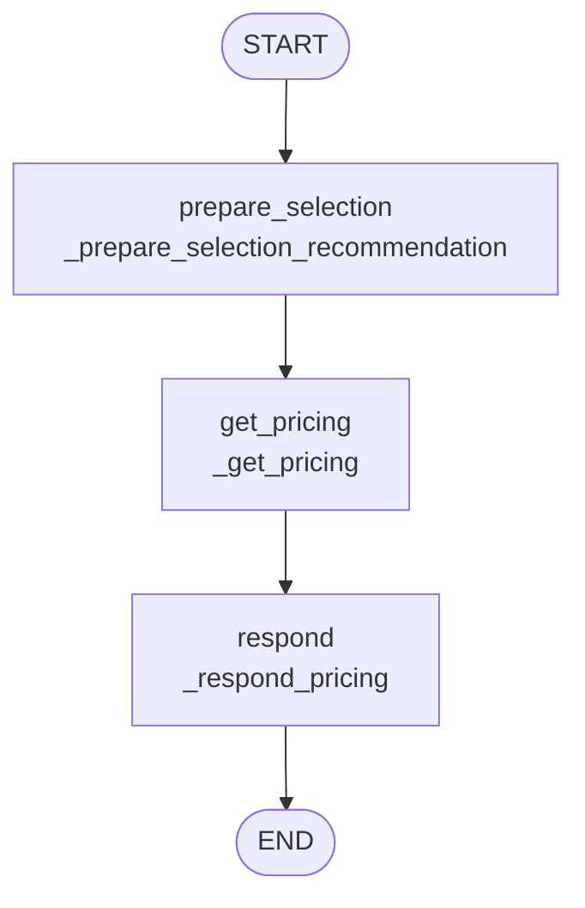
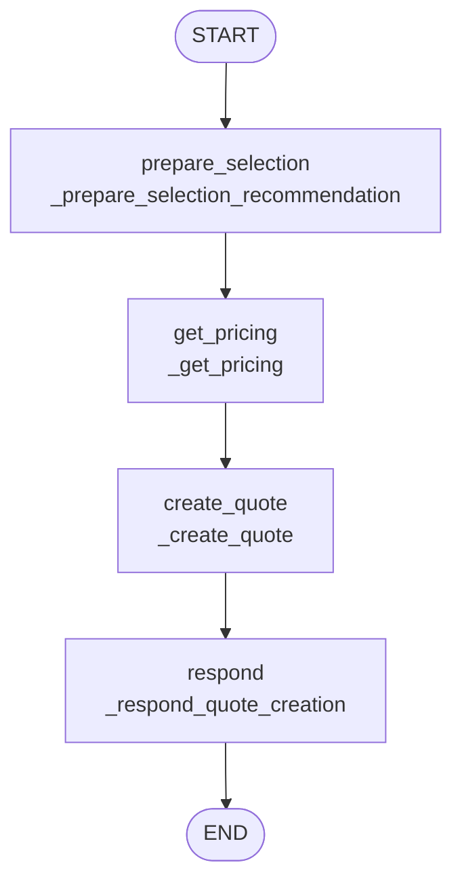
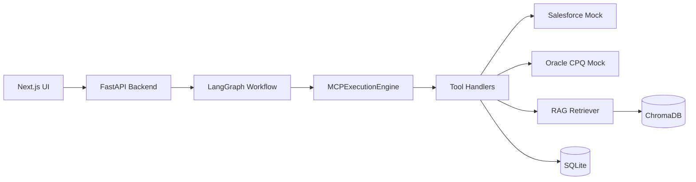

# LangGraph Workflow Diagrams

This document explains the main LangGraph workflows used by the Enterprise AI Agent Platform.

Use the Markdown/Mermaid version for GitHub-friendly documentation. Use
[`langgraph-workflow-diagram.html`](langgraph-workflow-diagram.html) for a
browser-rendered SVG version that does not depend on Mermaid support.

## Full Chat-To-Quote Graph

This is built by `build_agent_graph()` in `services/agent/graph.py`.

### What Each Node Does

| Graph node | Function | Main job |
| --- | --- | --- |
| `analyze` | `_analyze_intent` | Extract user input and selected Salesforce opportunity id into graph state. |
| `retrieve_context` | `_retrieve_context` | Optionally retrieve RAG knowledge snippets through MCP. |
| `get_opportunity` | `_get_opportunity` | Load Salesforce opportunity data through MCP. |
| `recommend_products` | `_recommend_products` | Ask CPQ recommendation logic for products through MCP. |
| `get_pricing` | `_get_pricing` | Ask CPQ pricing logic for line items, discounts, and totals through MCP. |
| `create_quote` | `_create_quote` | Create a CPQ quote through MCP. |
| `respond` | `_respond` | Build the final user-facing response using an LLM client or fallback message. |

## Recommendation-Only Graph

This is built by `build_recommendation_graph()`.

Use this when the sales rep wants recommended products and pricing for review, but has not created a quote yet.

## Pricing-Only Graph

This is built by `build_pricing_graph()`.

Use this when the user has already selected products and only wants the current selection repriced.

## Quote-Creation Graph

This is built by `build_quote_creation_graph()`.

Use this when the sales rep has reviewed product selections and explicitly creates a persisted quote.

## Layer View

