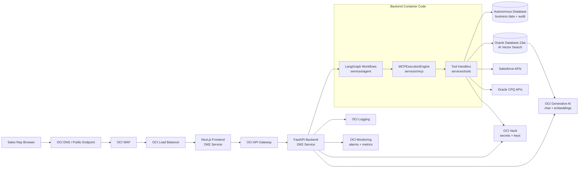
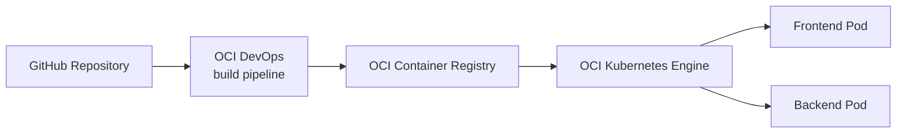
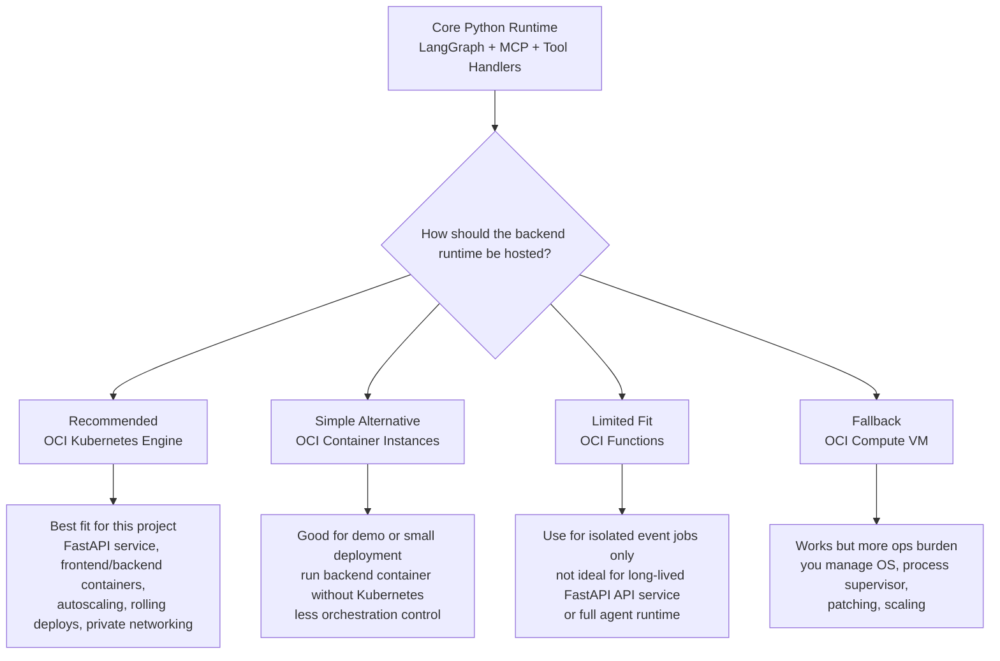
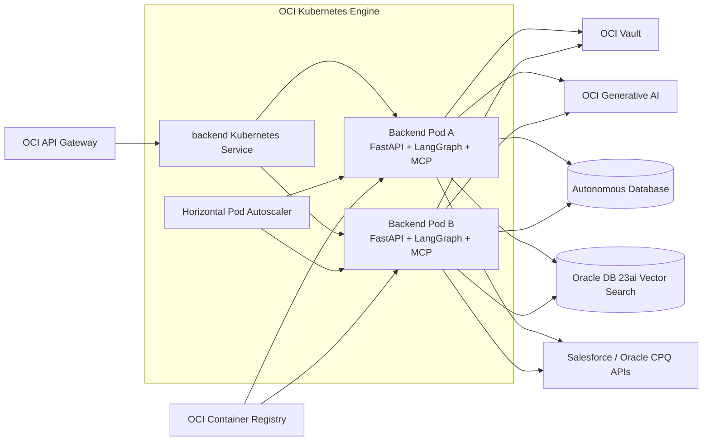
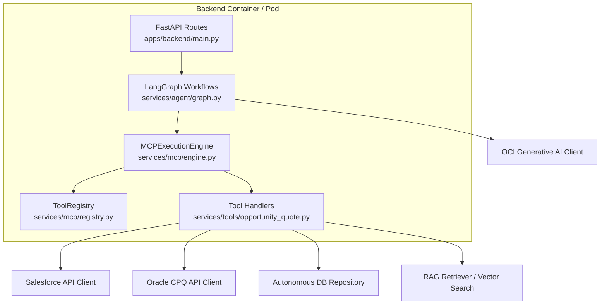
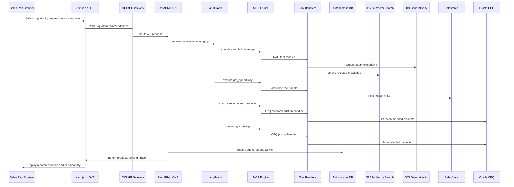
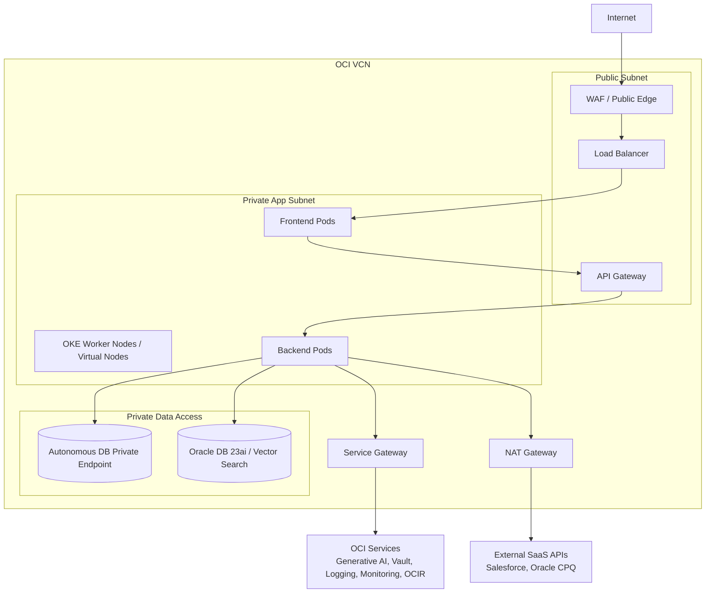

# OCI Deployment Architecture

This document maps the current Enterprise AI Agent Platform codebase to a target Oracle Cloud Infrastructure deployment.

## Recommended OCI Target

The first production-style OCI deployment should keep the project architecture intact:

- Keep Next.js as the frontend application.
- Keep FastAPI as the backend API.
- Keep LangGraph, MCP, and tool handlers inside the backend service.
- Replace local runtime stores and local Ollama with managed OCI services.
- Replace mock Salesforce and Oracle CPQ modules with real enterprise API integrations.

## High-Level Architecture

## Build And Deploy Flow

## Component Mapping

| Project component | Current local implementation | OCI target component | Notes |
| --- | --- | --- | --- |
| Frontend UI | `apps/frontend` Next.js container | OKE deployment behind OCI Load Balancer | Keep as containerized Next.js app. |
| Backend API | `apps/backend/main.py` FastAPI container | OKE deployment behind OCI API Gateway | API Gateway fronts backend routes and can add auth, throttling, CORS, and validation. |
| Container images | Local Docker build / Docker Compose | OCI Container Registry | Store frontend and backend container images in OCIR. |
| CI/CD | Manual local build or GitHub workflow later | OCI DevOps | Build, test, push images, and deploy to OKE. |
| Agent workflow | `services/agent/graph.py` LangGraph | Runs inside FastAPI backend pod | LangGraph remains application code, not an OCI service. |
| MCP boundary | `services/mcp` | Runs inside FastAPI backend pod | MCP remains the controlled tool execution boundary in code. |
| Business tools | `services/tools/opportunity_quote.py` | Runs inside FastAPI backend pod | Tool handlers call real services instead of mocks. |
| Salesforce mock | `integrations/salesforce/mock.py` | Salesforce REST APIs | Replace mock with real Salesforce integration and credentials from OCI Vault. |
| Oracle CPQ mock | `integrations/cpq/*` | Oracle CPQ / Fusion APIs | Replace mock CPQ logic with real CPQ APIs where available. |
| SQLite business DB | `app_data/business.sqlite3` | Autonomous Database Transaction Processing | Store accounts, opportunities, quotes, orders, activity, and agent runs. |
| ChromaDB vector DB | `chroma_db/` | Oracle Database 23ai AI Vector Search | Store embeddings with enterprise data using native vector search. |
| Ollama chat model | `ollama` Docker service | OCI Generative AI chat models | Replace `OllamaClient` with an OCI Generative AI client implementation. |
| Ollama embeddings | `nomic-embed-text` through Ollama | OCI Generative AI embeddings | Use managed embedding models for RAG ingestion/search. |
| Secrets | Local env vars | OCI Vault | Store Salesforce, CPQ, database, and AI service credentials. |
| Logs | Python logs / container output | OCI Logging | Centralize backend, OKE, API Gateway, and application logs. |
| Metrics and alarms | Local test output | OCI Monitoring | Track latency, errors, pod health, API metrics, and alarms. |
| Runtime files | Local volumes | Object Storage where needed | Use for exported artifacts, backups, and generated documents if needed. |

## Core Application Runtime: LangGraph And MCP

LangGraph and the MCP engine are not OCI-managed services in this architecture. They are Python application logic that should run inside the backend container.

The OCI decision is therefore not "which OCI service replaces LangGraph or MCP?" The decision is "which OCI compute service should host the backend container that runs LangGraph and MCP?"

### Recommended Runtime Shape

### What Runs Inside The Backend Pod

### Component Choice For LangGraph

| Choice | Fit | Why |
| --- | --- | --- |
| Run inside FastAPI backend pod on OKE | Recommended | LangGraph is request-time orchestration code. It needs Python dependencies, internal state dictionaries, tool calls, logging, and predictable API latency. |
| Run as separate microservice | Possible later | Useful only if multiple backend services need to call the same agent runtime. Adds network and versioning complexity. |
| Run in OCI Functions | Usually not preferred | Better for isolated event handlers than a full always-available API orchestration service. |
| Replace with OCI Generative AI Agents | Optional future redesign | Would change the architecture. Current project already owns orchestration with LangGraph and MCP. |

### Component Choice For MCP Engine And Tools

| Choice | Fit | Why |
| --- | --- | --- |
| Run inside FastAPI backend pod on OKE | Recommended | MCP engine is an in-process control boundary. Keeping it with LangGraph avoids extra network hops and keeps tool execution auditable in one request trace. |
| Split each tool into a separate OCI Function | Possible for specific tools | Useful for long-running or independently scaled jobs, but adds invocation latency and distributed error handling. |
| Put MCP behind a separate internal API service | Possible later | Useful if many applications share the same governed tool layer. Adds operational complexity. |
| Replace MCP with direct integration calls | Not recommended | Removes the governance boundary that keeps the agent from directly calling Salesforce, CPQ, RAG, or database code. |

## Runtime Request Flow On OCI

## OCI Network Layout

## Migration Notes

### Keep In Code

These remain application code running inside the backend container:

- LangGraph orchestration
- MCP execution engine
- Tool registry
- Tool handlers
- Prompt construction
- API response shaping

### Replace With Managed OCI Services

These local/demo dependencies should move to OCI services:

- SQLite -> Autonomous Database
- ChromaDB -> Oracle Database 23ai AI Vector Search
- Ollama chat -> OCI Generative AI chat
- Ollama embeddings -> OCI Generative AI embeddings
- Local env secrets -> OCI Vault
- Local logs -> OCI Logging
- Local operational checks -> OCI Monitoring alarms

### Replace With Enterprise APIs

These demo mocks should become real integrations:

- `integrations/salesforce/mock.py` -> Salesforce REST API client
- `integrations/cpq/*` -> Oracle CPQ API client or Fusion CPQ integration

## Implementation Phases

1. Containerize and publish frontend/backend images to OCI Container Registry.
2. Deploy frontend and backend to OKE.
3. Put Load Balancer and API Gateway in front of the services.
4. Move secrets into OCI Vault.
5. Replace SQLite with Autonomous Database.
6. Replace Ollama chat and embeddings with OCI Generative AI.
7. Replace ChromaDB with Oracle Database 23ai AI Vector Search.
8. Replace Salesforce and CPQ mocks with real API clients.
9. Add OCI Logging, Monitoring, alarms, and dashboards.
10. Automate build and deployment with OCI DevOps.
