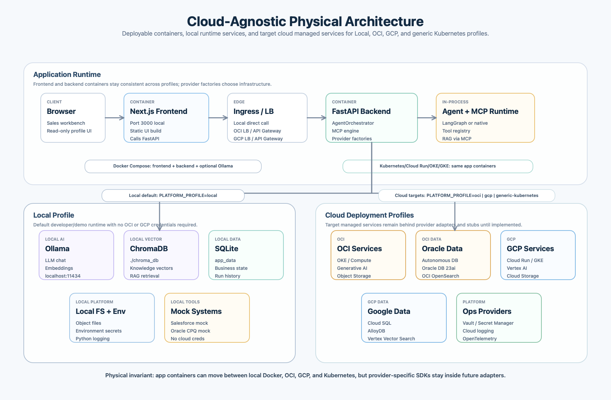

# Physical Architecture Diagram

Author: Sarala Biswal



This diagram shows the deployable runtime shape:

- The browser uses the Next.js frontend container.
- Next.js calls the FastAPI backend container through local networking or a cloud edge layer.
- FastAPI hosts `AgentOrchestrator`, MCP, provider factories, and tool execution.
- The local profile uses Ollama, ChromaDB, SQLite, local filesystem storage, environment variables, Python logging, and mock Salesforce/Oracle CPQ systems.
- OCI, GCP, and generic Kubernetes profiles map to managed infrastructure targets behind provider adapters.
- Cloud SDKs and provider-specific clients are intentionally absent until the corresponding adapter implementation work is added.

Regenerate the image with:

```bash
swift scripts/generate_physical_architecture_diagram.swift
```
